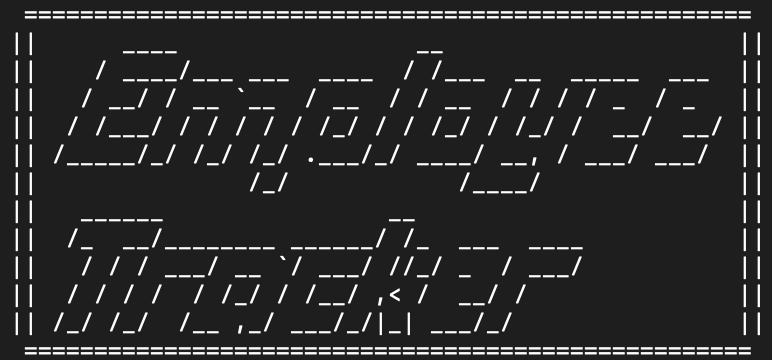
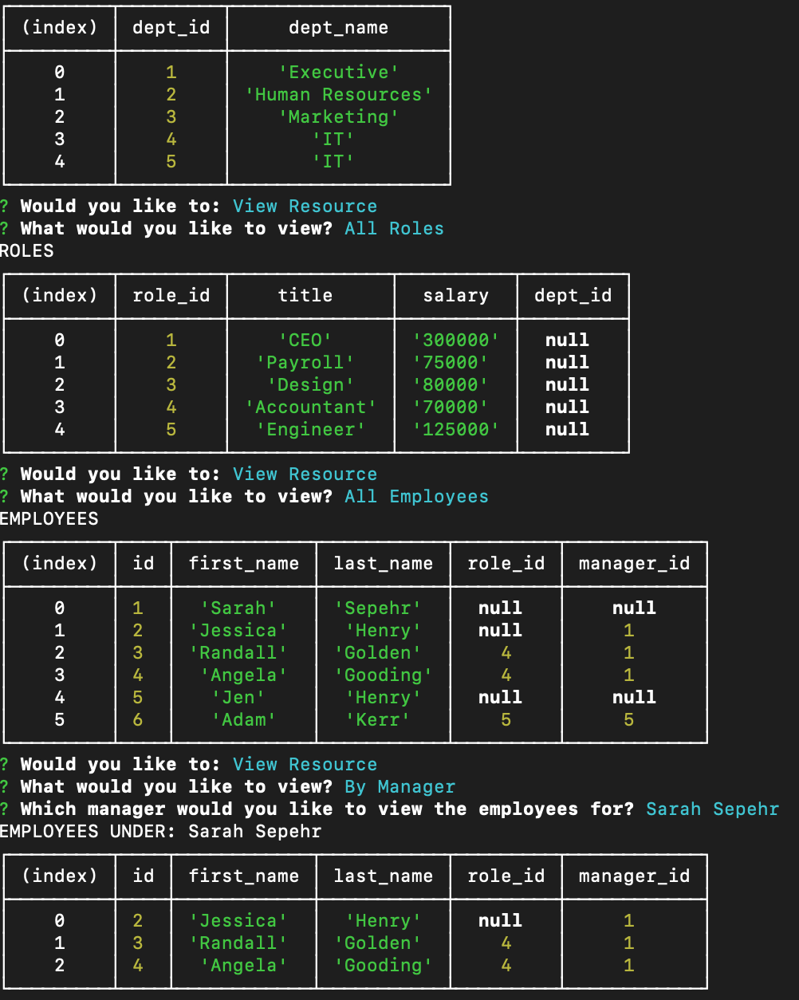

# Employee Tracker

## Installation
GitHub:  https://github.com/jenryhennifer/employeeTracker

YouTube Demo:  https://www.youtube.com/watch?v=7gOH9BgTj5E&feature=youtu.be

## Tech Used

* JavaScript
* NPM
    * Inquirer
    * mySQL
* SQL
* Databases

<hr />

## Sample




<hr />

## Description 

The purpose of this project was to create a Content Management System (CMS) to manage employees of a company. The user is given the opprotunity to add, delete, or view departments, roles, and employees. 

```
var connection = mysql.createConnection({
  host: 'localhost',

  // Your port; if not 3306
  port: 3306,

  // Your username
  user: 'root',

  // Your password
  password: 'password',
  database: 'employeeTracker',
});
```

The user is given a screen that asks whether they want to add a resource, delete a resource, view a resource, update an employee, or quit the program. A switch statement was used to determine which option was desired.

```
switch (res.AddViewUpdate) {
    case 'Add Resource':
      return add();
    case 'Delete Resource':
      return deleteRequest();
    case 'View Resource':
      return view();
    case 'Update Employee':
      return updateEmployee();
    default:
      return console.log('goodbye');
    }
```
When Add resource was chosen, the user is given another series of prompts asking if they want to add a department, role, or employee. They are then prompted details about each resource, but when employee is chosen the user gets a chance to choose between manager or regular employee. Two elements from manager information is concatinated to show both first and last name:

```
const managerList = response.map((manager) =>
    manager.first_name.concat(' ', manager.last_name));
```

When delete resources were chosen the user is prompted to choose between department, roles, and employees; then given a list of all departemnt, roles, or employees to choose from. 


If view resources was chosen, the user is given a prompt for all departments, all roles, all employees, and emloyees by manager. console.table() was used to organize the data in a visually appealling manner.



If update employee was chosen then the user is given a list of employees to upate the role for. Then they are given a list of roles to change to.

mySQL was used to create the database. Three tables were made inside the database: departments, roles, and employees. See below code to see elements added to the employees table:

```
CREATE TABLE employees(
  id INT NOT NULL AUTO_INCREMENT,
  first_name VARCHAR(30) NOT NULL,
  last_name VARCHAR(30) NOT NULL,
  role_id INT,
  manager_id INT,
  PRIMARY KEY (id),
  FOREIGN KEY (manager_id) REFERENCES employees(id)
  FOREIGN KEY (role_id) REFERENCES roles(role_id)
);
```

Foreign keys were used to connect all the tables together by a single element. 


<hr />

## License

MIT License

Copyright (c) 2020 Jennifer Henry

Permission is hereby granted, free of charge, to any person obtaining a copy of this software and associated documentation files (the "Software"), to deal in the Software without restriction, including without limitation the rights to use, copy, modify, merge, publish, distribute, sublicense, and/or sell copies of the Software, and to permit persons to whom the Software is furnished to do so, subject to the following conditions:

The above copyright notice and this permission notice shall be included in all copies or substantial portions of the Software.

THE SOFTWARE IS PROVIDED "AS IS", WITHOUT WARRANTY OF ANY KIND, EXPRESS OR IMPLIED, INCLUDING BUT NOT LIMITED TO THE WARRANTIES OF MERCHANTABILITY, FITNESS FOR A PARTICULAR PURPOSE AND NONINFRINGEMENT. IN NO EVENT SHALL THE AUTHORS OR COPYRIGHT HOLDERS BE LIABLE FOR ANY CLAIM, DAMAGES OR OTHER LIABILITY, WHETHER IN AN ACTION OF CONTRACT, TORT OR OTHERWISE, ARISING FROM, OUT OF OR IN CONNECTION WITH THE SOFTWARE OR THE USE OR OTHER DEALINGS IN THE SOFTWARE.


<hr />
<hr />

# Author

* [LinkedIn](https://www.linkedin.com/in/jennifer-henry-4a540a149/)
* [GitHub](https://github.com/jenryhennifer)
* jenhenry1995@gmail.com
